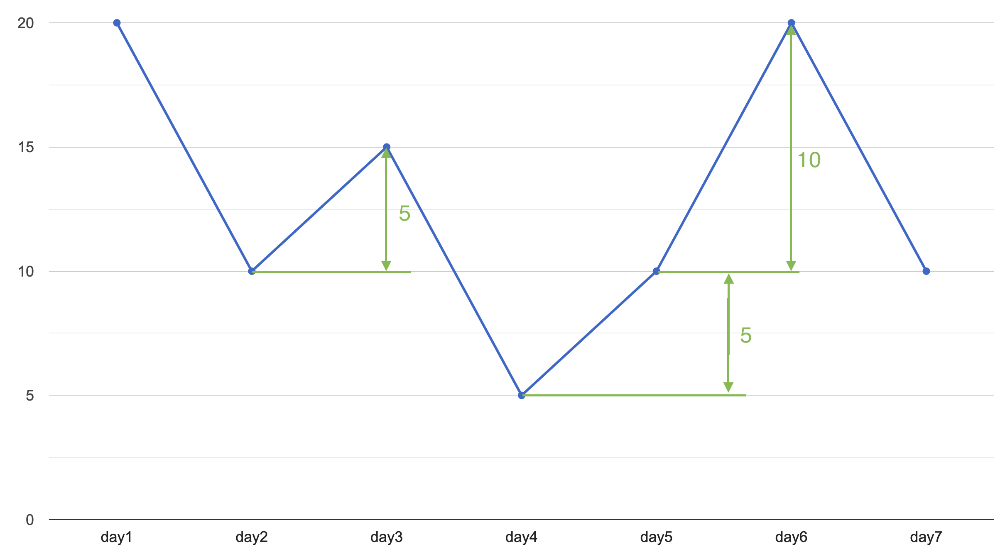

# Лучшее время для покупки и продажи акций 2
[leetcode](https://leetcode.com/problems/best-time-to-buy-and-sell-stock-ii/)

Сложность: Средняя

## Оглавление

- [Описание задачи](#description)
- [Решение через локальные минимумы и максимумы](#peak_and_valley)
- [Решение через восходящие тренды](#simple_pass)

---

## <a name="description"></a>Описание

Вам дан целочисленный массив цен `prices`, где `prices[i]` — цена акции на `i-й` день.

Каждый день вы можете принять решение о покупке и/или продаже акции.
Вы можете одновременно владеть не более одной акцией.


Найдите и верните максимальную прибыль, которую вы можете получить.

### Ограничения

- В массиве может быть от 1 до 3 * 10^4 элементов
- В качестве значений могут быть числа в диапазоне от 0 до 10 ^ 4

### Примеры

#### Пример 1

```
Вход:  [7,1,5,3,6,4]
```
```
Ответ: 7
```
Покупайте в день 2 (цена = 1) и продавайте в день 3 (цена = 5), прибыль = 5-1 = 4.
Затем купите в день 4 (цена = 3) и продайте в день 5 (цена = 6), прибыль = 6-3 = 3.

Общая прибыль равна 4 + 3 = 7.

#### Пример 2

```
Вход:  [1,2,3,4,5]
```
```
Ответ: 4
```
Покупайте в день 1 (цена = 1) и продавайте в день 5 (цена = 5)

Прибыль = 5-1 = 4.

#### Пример 3

```
Вход:  [7,6,4,3,1]
```
```
Ответ: 0
```

Невозможно получить положительную прибыль, поэтому мы никогда не покупаем акции.

Прибыль = 0.

## <a name="peak_and_valley"></a> Решение через локальные минимумы и максимумы

Для получения максимальной прибыли при торговле акциями нам необходимо покупать их по самой низкой цене и продавать по самой высокой.
Это означает, что покупки нужно делать в локальных минимумах, а продажу в локальных максимумах.

Возьмем для примера следующий массив цен в долларах `[20, 10, 15, 5, 10, 20, 10]` и представим его в виде графика.


Теперь на графике хорошо видно, что нам нужно сделать две покупки и две продажи:
- купить акцию на второй день за 10 и продать на третий день за 15
- купить акцию на четвертый день за 5 и продать на шестой день за 20

В итоге мы сможем получить максимальную прибыль и заработать $20.

Таким образом решение задачи сводится к тому, что нужно проходить весь массив и искать в нем локальные минимумы и локальные максимумы.
Как только мы встречаем минимум, мы запоминаем цену в этот день. Как только встречаем максимум, мы вычисляем разницу между
последним минимумом и максимальной ценой и прибавляем ее к нашему общему заработку.

[Решение на GO](./go/solution.go)

[Решение на TypeScript](./ts/solution.ts)

### Оценка сложности

N - количество элементов в массиве

- Сложность по времени O(N), так как мы итерируемся по всем элементам массива
- Сложность по памяти O(1), так как мы не создаем дополнительных переменных.


## <a name="peak_and_valley"></a> Решение через восходящие тренды

Если внимателнно посмотреть на график, то можно заметить, что максимальная возможная прибыль складывается из сумм 
разниц стоимости акции между днями на восходящих трендах.



Это значит, что мы можем сильно уростить решение и не запоминать локальные минимумы и максимумы.
Нам достаточно найти все возрастающие отрезки на графике и проссумировать разницу между ценой акции в эти дни.

[Решение на GO](./go/solution.go)

[Решение на TypeScript](./ts/solution.ts)

### Оценка сложности

N - количество элементов в массиве

- Сложность по времени O(N), так как мы итерируемся по всем элементам массива
- Сложность по памяти O(1), так как мы не создаем дополнительных переменных.
